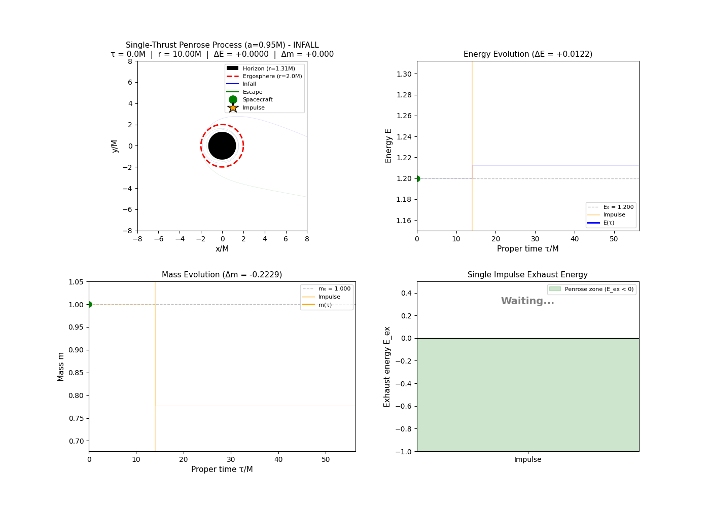
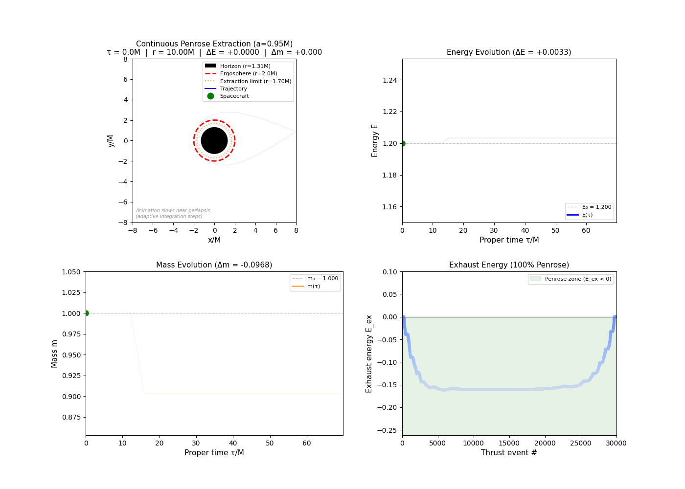

# Penrose Energy Extraction via Rocket Propulsion

[](https://arxiv.org/abs/2601.19616) [](LICENSE)

Numerical study of energy extraction from rotating (Kerr) black holes via the Penrose process using rocket propulsion. This repository accompanies the paper [*"On the rarity of rocket-driven Penrose extraction in Kerr spacetime"*](https://arxiv.org/abs/2601.19616).

## Results

Through **252,000 trajectory simulations** (112,000 main experimental phases + 140,000 spin-threshold characterization), we establish:

| Finding | Value |
|---------|-------|
| Broad-scan success rate ($a/M = 0.95$) | ~1% |
| Sweet-spot success rate ($a/M \geq 0.95$) | 11--14% |
| Peak success rate ($v_e = 0.98c$, $\delta m = 0.4$) | ~88.5% |
| Critical spin threshold | $0.88 < a_{\rm crit}/M \lesssim 0.89$ |
| Single-impulse efficiency | $\eta_{\rm cum} \approx 19\%$ |
| Continuous thrust efficiency | 2--4% |

**Sweet spot parameters:** specific energy $E_0 \approx 1.2$, specific angular momentum $L_z \approx 3.0$, $v_e \gtrsim 0.91c$

---

## Visualizations

### Single Impulse Thrust
A single impulsive burn at periapsis achieves maximum efficiency (~19%) by concentrating all thrust at the point of minimum exhaust energy.



### Continuous Thrust
Sustained thrust throughout the ergosphere passage demonstrates path-averaging effects that reduce efficiency to 2--4%.



---

## Physics Overview

### The Penrose Process

Within the **ergosphere** of a Kerr black hole, the stationary Killing vector becomes spacelike, permitting **negative-energy states**. A spacecraft can exploit this by ejecting exhaust with negative Killing energy $E_{\rm ex} < 0$, gaining energy at the expense of the black hole's rotation.

### Propulsion Model

We work in the **test-particle limit** ($m_0 \ll M$), so backreaction and self-force are negligible. The code implements exact 4-momentum conservation:

$$p'_\mu = p_\mu - \delta\mu \, u_{{\rm ex},\mu}$$

where the exhaust 4-velocity is $u_{\rm ex}^\mu = \gamma_e(u^\mu - v_e s^\mu)$ for exhaust speed $v_e$ and spatial direction $s^\mu$ orthogonal to the rocket's 4-velocity.

**Penrose signature:** Energy extraction occurs when exhaust Killing energy $E_{\rm ex} = -\gamma_e(u_t - v_e s_t) < 0$.

---

## Repository Structure

```
penrose_process/
|-- kerr_utils.py                  # Kerr metric, geodesic equations, impulse mechanics
|-- single_thrust_case.py          # Single impulsive burn at periapsis
|-- continuous_thrust_case.py      # Sustained ergosphere thrust (RK4 integrator)
|-- pyproject.toml                 # Package configuration
|-- experiments/
|   |-- trajectory_classifier.py   # Orbit classification (flyby, plunge, bound)
|   |-- parameter_sweep.py         # Grid-based parameter exploration
|   |-- comprehensive_sweep.py     # Full statistical sweeps
|   |-- thrust_comparison.py       # Strategy comparison (geodesic/impulse/continuous)
|   |-- ensemble.py                # Monte Carlo analysis with BCa bootstrap CIs
|   |-- run_trajectory_study.py    # CLI orchestrator
|   |-- generate_prd_figures.py    # Paper figure generation (6 figures)
|   |-- regenerate_sweep_data.py   # Sweep data regeneration
|   |-- trajectory_visualization.py # Animated GIF generation
|   |-- phase_space.py             # Phase-space (E, Lz) diagrams
|   `-- benchmark.py               # Performance and reproducibility tracking
|-- tests/
|   |-- test_conservation_laws.py  # Conservation laws and analytical solutions
|   |-- test_derivatives.py        # Kerr metric derivative validation
|   |-- test_null_cases.py         # Schwarzschild and outside-ergosphere null tests
|   |-- test_geodesic.py           # Pure geodesic flyby validation
|   |-- test_optimal_thrust.py     # Optimal thrust direction test
|   |-- test_retrograde_thrust.py  # Retrograde exhaust Penrose condition test
|   |-- test_E_ex_directions.py    # Exhaust energy directional dependence
|   `-- test_integrator_convergence.py # ODE solver accuracy analysis
|-- results/                       # Pre-computed sweep data (JSON)
|-- figures/                       # Generated paper figures (PDF/PNG)
`-- visualizations/                # Animated GIFs
```

---

## Installation

```bash
pip install -e .
```

This installs the package in editable mode, making all modules importable without path hacks.

**Requirements:** Python >= 3.8, numpy, scipy, matplotlib, pandas

---

## Usage

### Run simulations

```bash
# Single impulse case
python single_thrust_case.py

# Continuous thrust case
python continuous_thrust_case.py
```

### Parameter studies

```bash
# Quick validation (~2 min)
python experiments/run_trajectory_study.py --mode quick

# Standard study (~10 min)
python experiments/run_trajectory_study.py --mode standard

# Full analysis (~30 min)
python experiments/run_trajectory_study.py --mode full
```

### Generate animations

```bash
python experiments/trajectory_visualization.py --spin 0.95
```

### Run tests

```bash
# Run all tests (requires pip install pytest)
pytest tests/

# Or run individual test files directly
python tests/test_conservation_laws.py
python tests/test_null_cases.py
```

---

## Reproducing Paper Figures

All six figures from the paper can be reproduced using the provided scripts.

### Quick reproduction (uses existing/fallback data)

```bash
# Generate all 6 figures (PDF + PNG)
python experiments/generate_prd_figures.py
```

This creates `figures/fig1_orbit_classification.pdf` through `figures/fig6_ultrarel_saturation.pdf`.

### Full regeneration from simulations

To regenerate the underlying sweep data from scratch (~120,000 trajectories, 4-8 hours):

```bash
# Regenerate JSON data for Figures 5 and 6
python experiments/regenerate_sweep_data.py

# Then generate figures from new data
python experiments/generate_prd_figures.py
```

Options for `regenerate_sweep_data.py`:
- `--fig5`: Only regenerate Figure 5 data (velocity phase transition)
- `--fig6`: Only regenerate Figure 6 data (ultra-relativistic saturation)
- `--quick`: Quick test mode (50 samples/point instead of 500)
- `--workers N`: Number of parallel workers

### Figure descriptions

| Figure | File | Description |
|--------|------|-------------|
| 1 | `fig1_orbit_classification.pdf` | Orbit classification in $(E_0, L_z)$ space |
| 2 | `fig2_ensemble_statistics.pdf` | Penrose success rate vs spin |
| 3 | `fig3_thrust_comparison.pdf` | Single-impulse vs continuous thrust |
| 4 | `fig4_spin_dependence.pdf` | Spin dependence of extraction window |
| 5 | `fig5_thrust_sensitivity.pdf` | Velocity phase transition at $v_e \approx 0.91c$ |
| 6 | `fig6_ultrarel_saturation.pdf` | Efficiency saturation as $v_e \to c$ |

---

## Numerical Configuration

The continuous thrust integrator uses classical RK4 with mass-shell projection. For geodesic phases, the recommended solver settings are:

```python
from scipy.integrate import solve_ivp

solution = solve_ivp(
    geodesic_rhs,
    t_span=(0, tau_max),
    y0=initial_state,
    method='DOP853',      # 8th-order Dormand-Prince
    rtol=1e-10,
    atol=1e-12,
)
```

Initial conditions: $r_0 = 15M$, escape radius: $50M$

---

## References

1. R. Penrose and R. M. Floyd, *Nature Phys. Sci.* **229**, 177 (1971). [doi:10.1038/physci229177a0](https://doi.org/10.1038/physci229177a0)

2. R. M. Wald, *Astrophys. J.* **191**, 231 (1974). [doi:10.1086/152959](https://doi.org/10.1086/152959)

3. S. Chandrasekhar, *The Mathematical Theory of Black Holes* (Oxford University Press, 1983).
